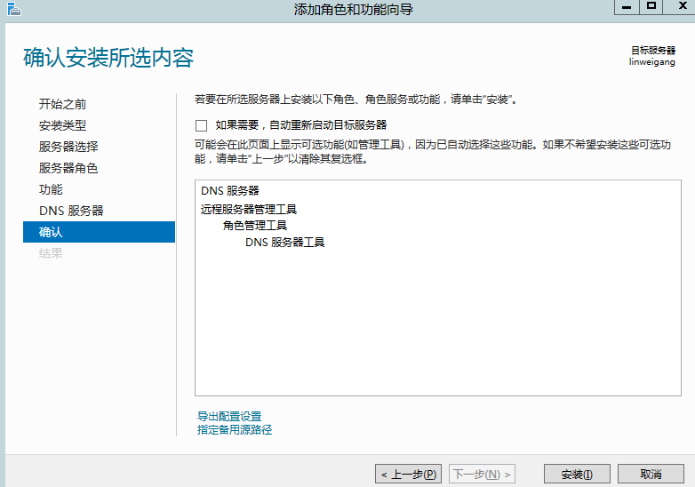
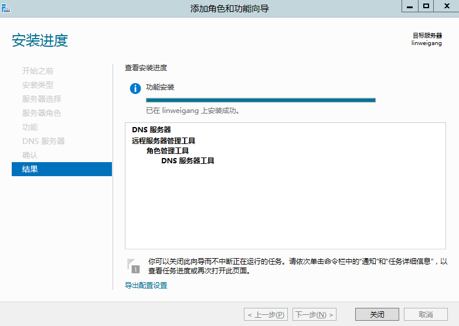

DNS(Domain Name System)，域名系统，因特网上作为域名和IP地址相互映射的一个分布式数据库，能够使用户更方便的访问互联网，而不用去记能够被机器直接读取的IP地址。

DNS服务主要起到两个作用：

    1.	可以把相对应的域名解析为对应的IP地址，叫做正向解析。

    2.	可以把相对应的IP地址解析为对应的域名，叫做方向解析。

在Windows Server 2012服务器上要搭建DNS服务器，首先需要安装DNS服务。

进入“添加角色和功能向导”


在这个地方会出现一个警告，因为DNS服务是要解析域名，每台电脑都有一个设置DNS服务器的配置，目的是用来指向查询DNS的IP地址，比如Google有一个DNS服务器为8.8.8.8，那么在本地电脑设置里面可以直接设置（如下图），那么每次用户使用浏览器访问web的时候，输入网址，DNS就会向8.8.8.8发出DNS查询IP地址的请求，8.8.8.8在收到查询之后会返回对应的IP地址。那么作为一个DNS服务器，很多客户端查询的情况下，要求不能掉线，不能改变IP地址，不然需要客户端经常跟随服务器修改上述DNS服务器的IP地址，非常的麻烦。这也就是下图中的备用DNS服务器的作用，当首选DNS被关机了，或者网络无法直接到的情况下，可以选择备用DNS服务器进行域名查询/解析。


接下来直接安装就行了。






----------
#配置DNS服务器#

打开DNS管理器


新建DNS


现在设置好客户端的DNS服务器地址就可以查询了。


本机地址为


那么查询一下linweigang这个域名的地址，则为


于是在本地搭建一个IIS服务器，那么就可以通过浏览器来访问DNS服务器同主机上的web服务了。


```javascript
  var ihubo = {
    nickName  : "草依山",
    site : "http://jser.me"
  }
```


----------

6/11/2014 4:26:01 PM 